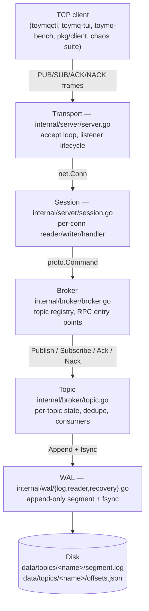
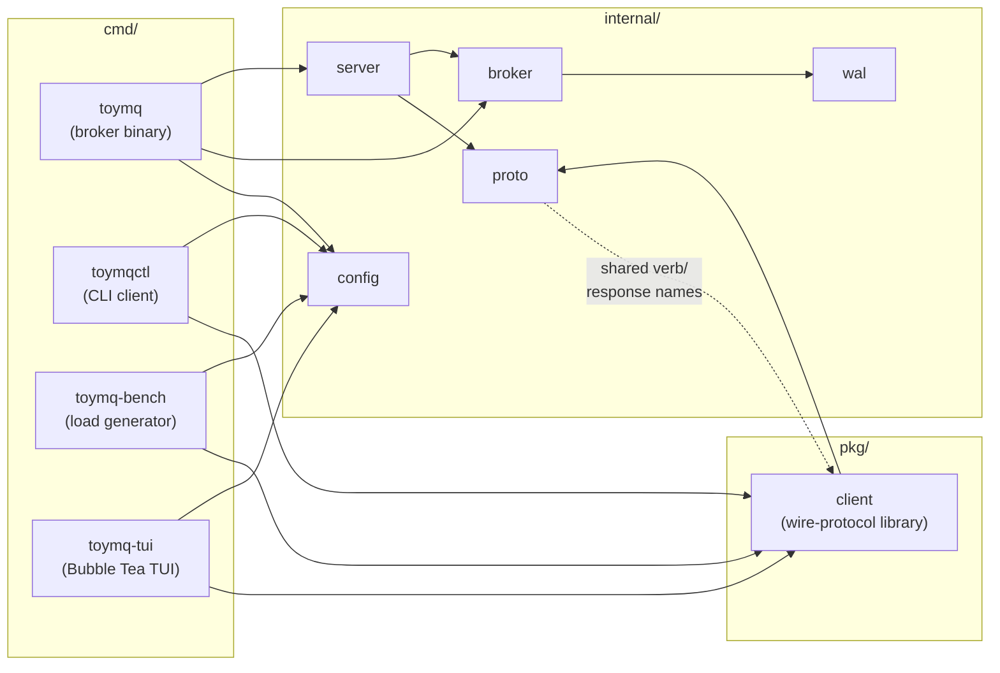
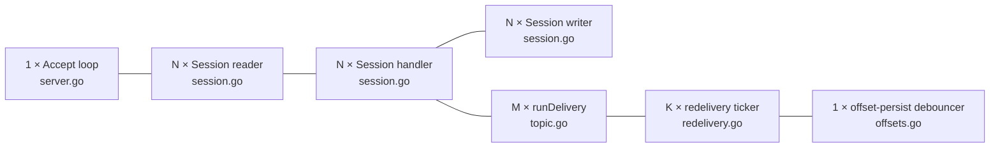
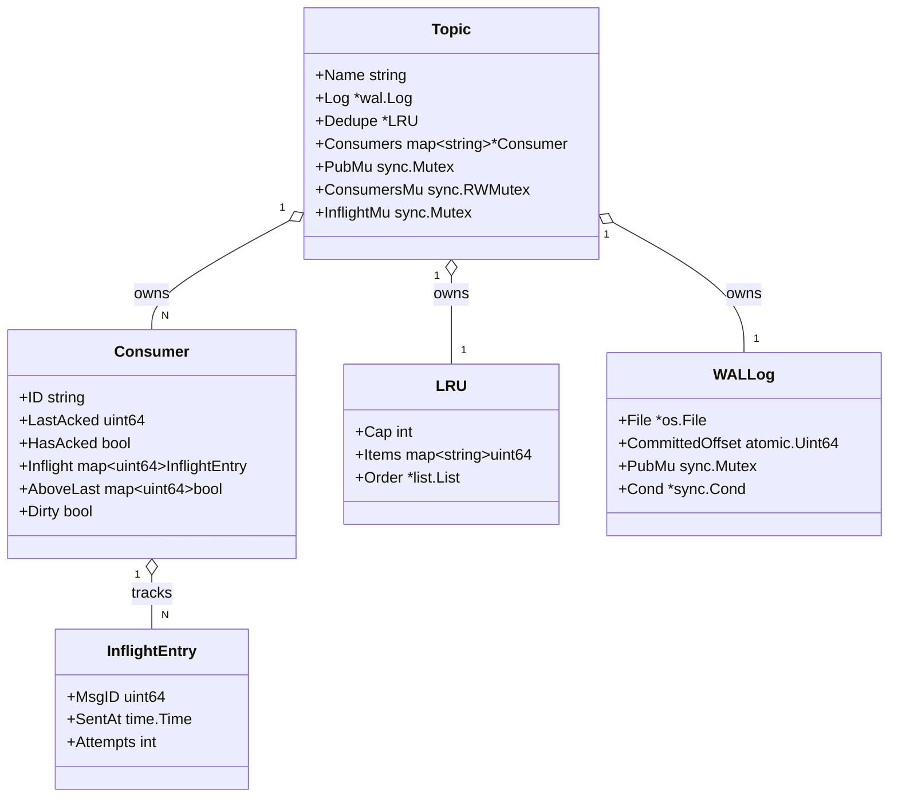
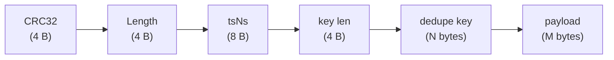

# ToyMQ — Architecture

Top-down map of ToyMQ's pieces. What lives where, how they fit together,
and the shape of the data they exchange. ADRs explain *why* each decision
was made; this doc explains *what* the system looks like.

See also: [`FLOWS.md`](./FLOWS.md), [`REDELIVERY.md`](./REDELIVERY.md),
[`PERSISTENCE.md`](./PERSISTENCE.md),
[`CONCURRENCY.md`](./CONCURRENCY.md), [`adr/`](./adr/README.md).

---

## 1. Layered architecture

ToyMQ is a single-node persistent message broker. From the network down
to the disk, every byte passes through five layers, each owning a single
responsibility.



Every arrow is a function call or a channel send within the same process
— ToyMQ has no inter-process boundaries except the TCP socket at the
top. A single binary holds the whole stack.

---

## 2. Component dependency graph

Go's package layout enforces a strict acyclic dependency graph. Higher
layers import lower ones; no `internal/` package depends on `pkg/` or
`cmd/`. This is an architectural invariant — breaking it means a circular
import and the compiler complains immediately.



`cmd/toymq-tui` is the only binary that pulls a third-party runtime
dependency (the Charm stack — `bubbletea`, `lipgloss`, `bubbles`).
Per [ADR 0014](./adr/0014-tui-framework-choice.md), those imports
stay confined to `cmd/toymq-tui/`; every other arrow in the graph
above resolves through stdlib only.

The dotted line from `proto` to `client` is conceptual: `pkg/client` does
not import `internal/proto` (Go rules forbid `pkg → internal`), but it
hand-formats wire frames that must match `proto`'s parser exactly. ADR
0013 names this constraint explicitly.

---

## 3. Runtime goroutine census

Knowing how many goroutines exist at steady state is the difference
between "I understand this" and "I'm scared to touch it." With `N` open
TCP connections, `M` active subscriptions, and `K` topics that have ever
seen a publish, the broker process holds:



Total: `2 + 3·N + M + K` goroutines. For a typical small load (N=10
clients, M=5 subs, K=3 topics) that's 40 goroutines. The accept loop and
the offset-persist debouncer are the only singletons; everything else
scales with the workload.

Symmetry note: each TCP connection produces three goroutines (reader,
handler, writer) on the server side and two (`readLoop`, the caller's
goroutine) on the `pkg/client` side. ADRs 0008 and 0013 explain why both
sides settled on "single writer, single reader" rules.

---

## 4. Topic / Consumer / Inflight data model

The state a Topic owns at runtime. WAL records flow through the Log on
disk; consumer offsets and inflight tracking sit in memory and persist
through the debounced offset writer.



`hasAcked` is the load-bearing flag explained in ADR 0011 — without it,
`lastAcked=0` is ambiguous between "never acked" and "acked msg 0." The
explicit boolean removes the ambiguity. `aboveLast` is the set of
out-of-order acked ids that haven't yet collapsed into a contiguous
prefix; ADR 0011's "Edge cases" section walks through the collapse rule.

---

## 5. WAL record byte framing

Every PUB writes one Record to the topic's WAL segment file. The frame
is self-describing: a CRC32 header guards everything that follows, and a
length prefix lets the recovery scanner cleanly detect a torn tail
without false-positives on partial trailing bytes.

```
┌────────┬────────┬──────────┬──────────┬─────────────┬─────────────┐
│  CRC32 │ Length │   tsNs   │ key len  │ dedupe key  │   payload   │
│  4 B   │  4 B   │   8 B    │   4 B    │  variable   │  variable   │
└────────┴────────┴──────────┴──────────┴─────────────┴─────────────┘
   ↑        ↑         ↑          ↑           ↑              ↑
   |        |         |          |           |              └─ raw bytes from PUB
   |        |         |          |           └─── UTF-8 string, "" if not provided
   |        |         |          └─── 0 means no dedupe key
   |        |         └─── nanosecond timestamp at append time
   |        └─── total bytes from tsNs through end of payload
   └─── CRC32 of (Length || tsNs || key len || dedupe key || payload)
```



The MsgID is **not** in the frame — it's derived from the byte offset of
the record within the segment file. This means MsgIDs are dense (no
gaps) and unforgeable (the on-disk position is the identity). ADR 0001
walks through the encoding choices; ADR 0003 covers how recovery uses
the CRC and length to find the torn-tail point.

Max record size is `MaxRecordSize = 4 MiB` (`internal/wal/record.go:8`),
enforced on Encode. Anything larger is a protocol error before bytes
hit disk.

---

## Where to look next

- **A specific command's behavior?** → [`FLOWS.md`](./FLOWS.md)
- **How at-least-once works?** → [`REDELIVERY.md`](./REDELIVERY.md)
- **What happens on restart?** → [`PERSISTENCE.md`](./PERSISTENCE.md)
- **How the goroutines coordinate?** → [`CONCURRENCY.md`](./CONCURRENCY.md)
- **Why a decision was made?** → [`adr/README.md`](./adr/README.md)
