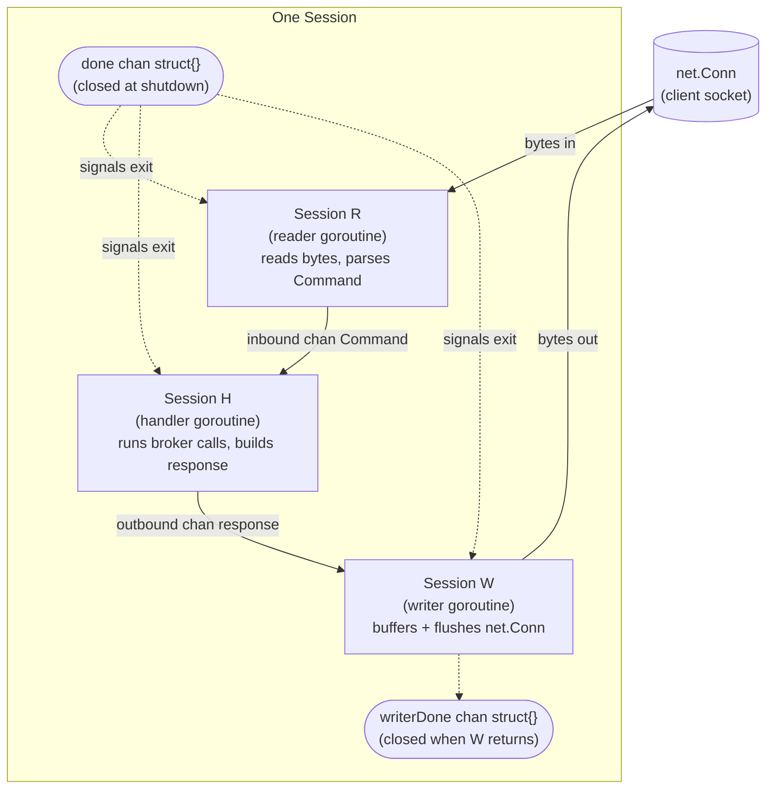
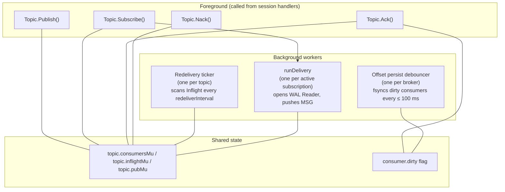
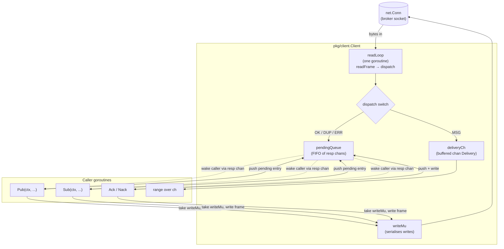
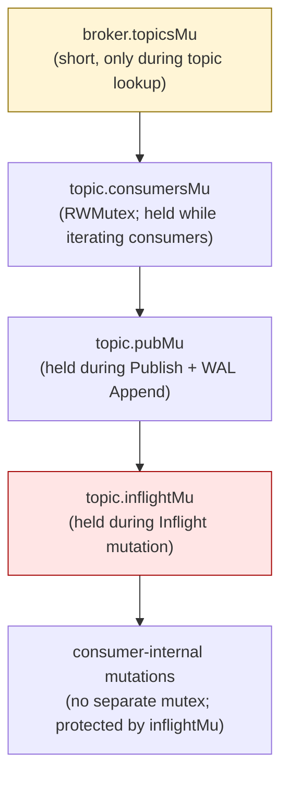
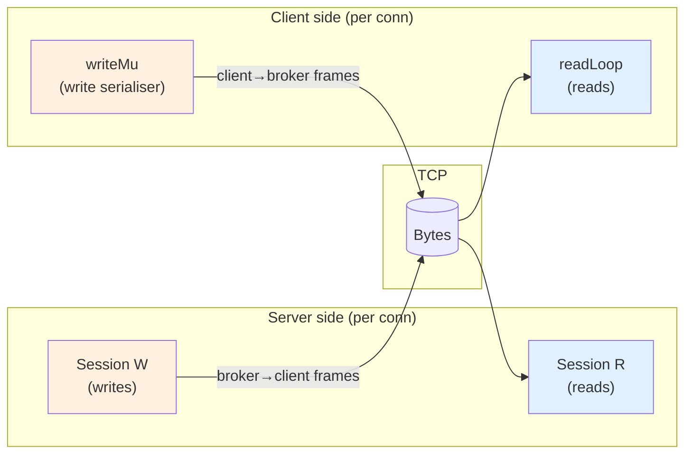

# ToyMQ — Concurrency Model

How the goroutines coordinate. ToyMQ has a small number of goroutine
*kinds* but many *instances* (the count formulas live in
[`ARCHITECTURE.md`](./ARCHITECTURE.md#3-runtime-goroutine-census)).
Each kind has a single responsibility and communicates with the rest
via channels or mutex-guarded shared state. This doc maps each kind to
its channels and lock dependencies.

See also: ADRs [`0007`](./adr/0007-visibility-timeout-redelivery.md),
[`0008`](./adr/0008-session-concurrency-model.md),
[`0013`](./adr/0013-pkg-client-architecture.md).

---

## 1. Per-Session goroutines — the four-channel model

Every accepted TCP connection produces three goroutines on the server
side. They communicate via three channels (`inbound`, `outbound`,
`done`) plus a fourth (`writerDone`) used only at shutdown. ADR 0008
introduced this model after a race surfaced during integration tests.

**Invariants.** Reader is the only goroutine that touches `net.Conn`
for reads. Writer is the only goroutine that touches `net.Conn` for
writes. Handler never touches the socket directly. This single-reader,
single-writer rule prevents partial-frame interleaving even under
heavy concurrent load.

**Shutdown order.** `done` is closed first. Reader sees `done` (via
select on the read deadline + done), closes `inbound`. Handler drains
`inbound`, then closes `outbound`. Writer drains `outbound`, flushes,
returns, and closes `writerDone`. The Server waits on `writerDone` to
know the session is fully clean.

ADR 0008 ends with a war story about the race that produced this model
— originally Reader and Handler were one goroutine, and a concurrent
Writer needed locks that turned out to deadlock with the broker. The
split removes the locks entirely.

---

## 2. Broker background workers

The broker has two background goroutine kinds: one **redelivery ticker
per topic**, and one **offset-persist debouncer per broker**. Both
coordinate with the foreground RPC handlers via mutex-guarded shared
state.

**Redelivery ticker** ([`REDELIVERY.md` §2](./REDELIVERY.md#2-redelivery-ticker--inside-the-loop)).
Acquires `topic.inflightMu`, scans every consumer's Inflight map,
returns expired entries to pending, releases the lock. Default
interval: 1 s (production), 20 ms (tests).

**Persist debouncer** ([`PERSISTENCE.md` §3](./PERSISTENCE.md#3-offsetsjson-atomic-swap)).
Wakes 100 ms after the most recent ACK marked some consumer dirty,
snapshots dirty consumers under `topic.consumersMu`, then writes
`offsets.json` outside the lock. ADR 0006 covers the choice.

**runDelivery** is technically per-subscription rather than per-topic,
but it lives in the broker layer and is one of the background
goroutines. It owns a WAL Reader and parks on `sync.Cond` when there's
nothing to deliver — see
[`FLOWS.md` §5](./FLOWS.md#5-sub-on-empty-topic-then-pub-triggers-msg).

---

## 3. `pkg/client` — read loop and dispatch

Mirrors the server's single-reader / single-writer rule on the client
side. One `readLoop` goroutine owns the conn for reads. Any number of
caller goroutines (`Pub`, `Sub`, `Ack`, `Nack`) serialise their writes
through `writeMu`. Responses route back via a head-of-queue pending
FIFO. ADR 0013 covers the full design.

**Invariant.** The wire protocol guarantees responses arrive in
request order. Therefore a single FIFO (no per-call routing keys) is
sufficient — the next OK/DUP/ERR frame always belongs to the entry at
the head of `pendingQueue`. A cancelled entry is tombstoned in place;
`dispatch` pops it, sees it's cancelled, and continues to the next
live entry.

**MSG vs response interleaving.** The dispatcher distinguishes by
verb. MSG frames go to `deliveryCh` regardless of what's at the head
of `pendingQueue`. OK frames always go to the pending head. This is
why a slow consumer of `deliveryCh` does not block in-flight Pub
calls — they live on independent paths.

---

## 4. Lock hierarchy — acquire order

ToyMQ has six locks total. Any code path that holds more than one
acquires them in the order below; holding them in reverse order would
deadlock. Anywhere a function reaches outside this hierarchy is a code
smell worth flagging.

Independent of this hierarchy:

- `wal.Log.pubMu` is acquired by `Log.Append` only, then released
  before any broker-level lock matters. Never held across topic locks.
- `pkg/client.writeMu` and `pkg/client.pendingQueue.mu` are
  independent and never held simultaneously by the same goroutine.
- The persist debouncer takes `topic.consumersMu` for read while
  snapshotting, then releases it before the fsync. The fsync is the
  longest-blocking I/O in the path; doing it outside any lock keeps
  the foreground responsive.

ADR 0007 calls out the topic-lock invariant explicitly because an
earlier broker draft acquired `inflightMu` first and `consumersMu`
inside; under contention this deadlocked against `Subscribe` which
acquired them the other way. The fix was to canonicalise the order.

---

## 5. Single-writer + single-reader invariants

Both ends of the wire follow the same rule: one goroutine reads, one
goroutine writes (per `net.Conn`). The symmetry is intentional — the
correctness argument on one side mirrors the other.

Same color = same role (blue reads, orange writes). The server uses a
dedicated writer goroutine; the client uses a mutex around an
otherwise-shared write path. The two approaches achieve the same
invariant — at most one goroutine writes to the conn at any instant —
and were chosen independently based on the surface area each side
needed.

ADR 0008 (server) and ADR 0013 (client) document the rationale in
detail. Both ADRs converge on the same root cause: TCP framing is byte
oriented, so interleaved writes from two goroutines produce a corrupt
frame. The fix is structural — make interleaving impossible.

---

## 6. Goroutine lifecycle reference

A quick lookup table for "when does each goroutine kind start and
exit?"

| Goroutine | Started by | Exits when | Lives in |
|---|---|---|---|
| Accept loop | `server.Serve` | `srv.Shutdown` closes listener | `internal/server/server.go` |
| Session R / H / W | `server.Serve` per Accept | `done` closes → drain → return | `internal/server/session.go` |
| `runDelivery` | `Topic.Subscribe` | `done` ctx cancelled or conn closes | `internal/broker/topic.go` |
| Redelivery ticker | `Topic.start` | broker shutdown (ctx cancel) | `internal/broker/redelivery.go` |
| Persist debouncer | `Broker.New` | broker shutdown (ctx cancel) + final flush | `internal/broker/offsets.go` |
| `pkg/client.readLoop` | `client.Dial` | conn read error or `Close` | `pkg/client/client.go` |
| TUI subscription pump | `readDeliveryCmd` (recursive `tea.Cmd`) | delivery channel closes → emits `transportLostMsg` | `cmd/toymq-tui/commands.go` |
| TUI request workers | each `pubCmd` / `subCmd` / `ackCmd` / `nackCmd` | blocking `pkg/client` call returns | `cmd/toymq-tui/commands.go` |

Every goroutine kind has a well-defined exit point. The chaos suite
verifies that no leak survives a 30 s soak with three SIGKILL restarts
— if it did, the next broker boot would inherit ports/files held by
the old one and fail.
