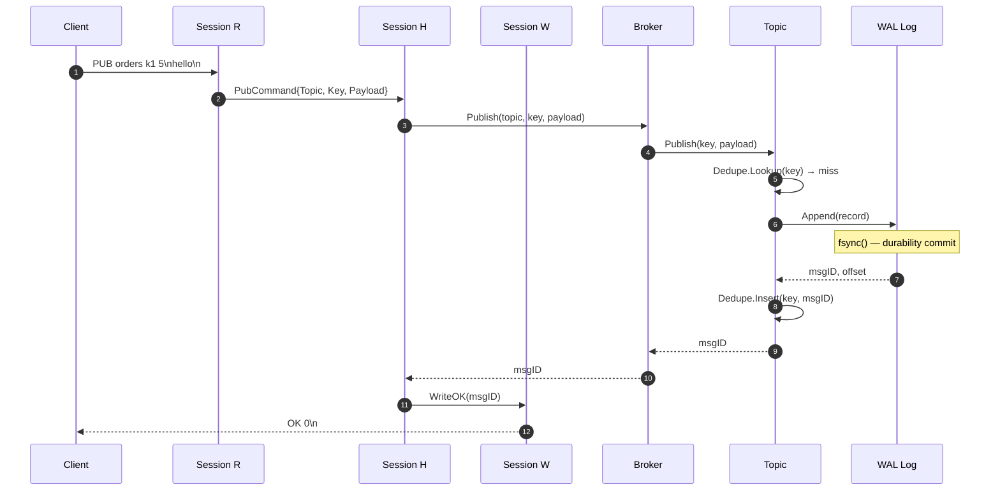
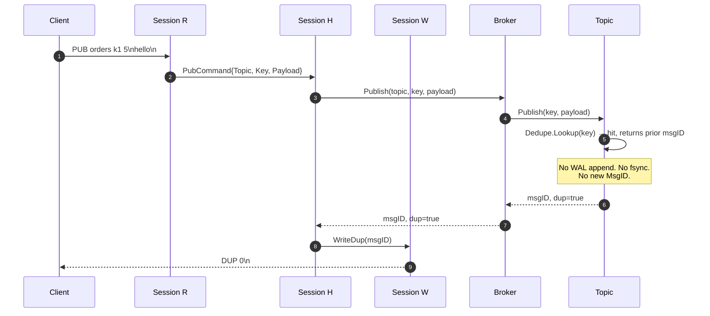
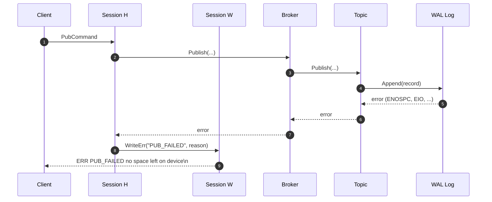
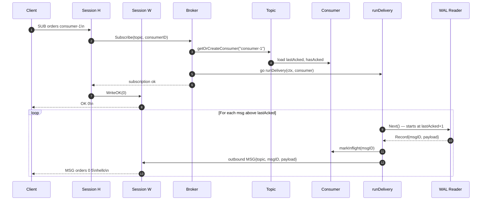
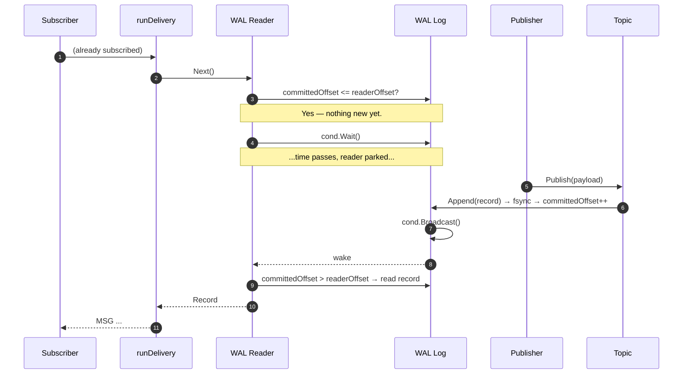
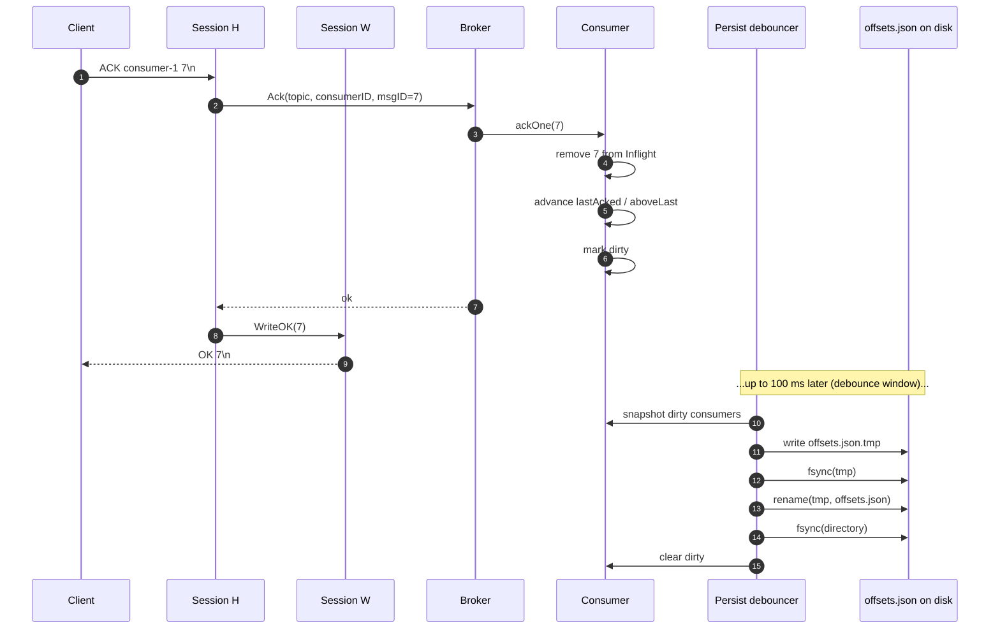
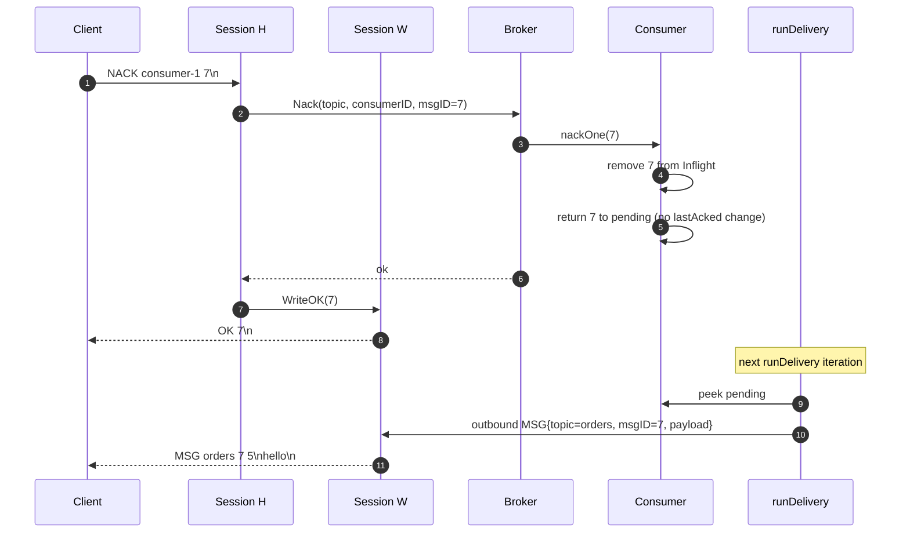
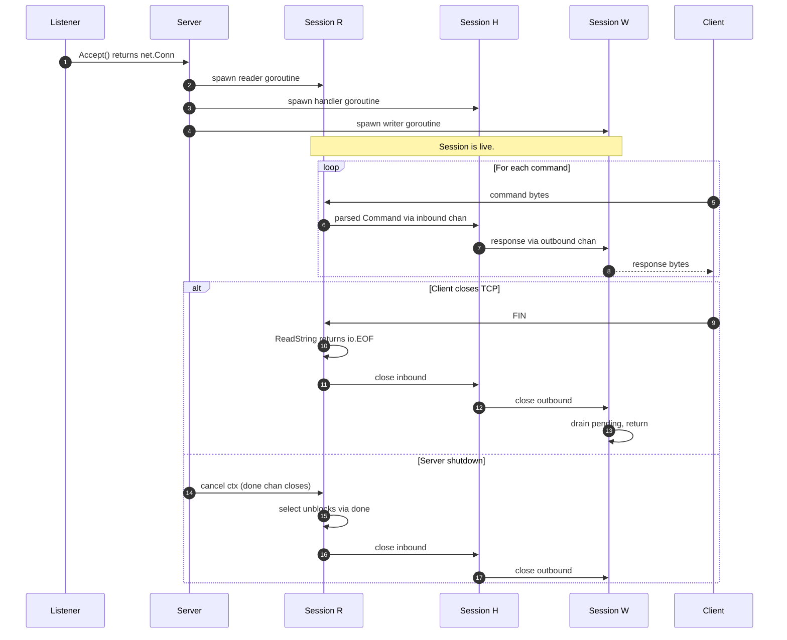

# ToyMQ — Command Flows

One sequence diagram per command path. When you want to know "what
exactly happens when a client sends X?", the answer is here.

The actor labels are uniform across diagrams:

- **Client** — anything speaking the wire protocol (`toymqctl`,
  `pkg/client`, raw `nc`, the chaos producer/consumer).
- **Session R/H/W** — the three goroutines of one server-side Session.
  Reader parses bytes, Handler runs broker calls, Writer flushes frames.
- **Broker / Topic / WAL** — the in-process layers from
  [`ARCHITECTURE.md`](./ARCHITECTURE.md).
- **Consumer** — the in-memory state for one `(topic, consumer_id)`
  pair.

See also: [`ARCHITECTURE.md`](./ARCHITECTURE.md),
[`REDELIVERY.md`](./REDELIVERY.md),
[`PERSISTENCE.md`](./PERSISTENCE.md),
[`CONCURRENCY.md`](./CONCURRENCY.md).

> **Handshake first (v2.0).** Every connection opens with a
> `HELLO <version> [AUTH <token>]` line answered by `HELLO 1 OK` (or
> `ERR HELLO`/`ERR AUTH` + close) **before** any of the flows below. It is
> handled synchronously by the Session reader, ahead of the Writer
> goroutine, so a rejection is never dropped. Full detail in
> [ADR 0020](./adr/0020-hello-auth-tls.md); with `--require-hello=false`
> the first command line is accepted directly (migration mode).

---

## 1. PUB — happy path

A publish completes in one network round-trip. The OK response is sent
**only after fsync** — that is the durability commit point. Before
fsync, a crash would lose the message; after fsync, the message
survives any unclean exit (kernel panic, SIGKILL, power off).

Step 6 (fsync) is the only blocking I/O on the critical path. ADR 0002
walks through why per-message fsync is the right default for a learning
broker and why batched fsync is a separate, opt-in mode.

---

## 2. PUB — dedupe hit, returns DUP

If the same dedupe key has been seen recently (within the in-memory LRU
window), the broker short-circuits: no WAL append, no new MsgID, no
fsync. The original MsgID echoes back as `DUP <id>`. The producer can
treat this exactly like an `OK` for idempotency purposes.

Limitations of in-memory dedupe (per ADR 0013's chaos analysis): the
LRU does not persist across broker restarts. After a SIGKILL the LRU is
empty; the same dedupe key gets a fresh MsgID. This is why the chaos
suite's no-loss invariant is `producer.OKs ⊆ consumer.seen` rather than
`producer.OKs == consumer.seen`.

---

## 3. PUB — `PUB_FAILED` error

If the WAL append fails (disk full, filesystem read-only, fsync error),
the broker returns `ERR PUB_FAILED <reason>`. The Topic does **not**
update its in-memory state — no MsgID is consumed and the dedupe LRU is
not touched. The producer can retry safely with the same dedupe key.

Note that the wire-level error code (`PUB_FAILED`) is intentionally
coarse — the underlying Go error is wrapped into the human-readable
reason but the code stays stable. `pkg/client` returns this as
`ErrServer` via `errors.Is`.

---

## 4. SUB with existing backlog

A new subscriber whose `consumer_id` has either never been seen, or
whose `lastAcked` is below the topic's high-water mark, drains the
backlog before going live-tailing. `runDelivery` is a per-subscription
goroutine spawned by `Broker.Subscribe`.

After the backlog drains, `Reader.Next` blocks on a `sync.Cond` inside
the WAL Log. A subsequent PUB calls `Log.Append`, which broadcasts the
cond, the reader wakes, and the new MSG flows out the same path. The
next diagram shows that wake-up explicitly.

---

## 5. SUB on empty topic, then PUB triggers MSG

The most subtle flow in the system: how a tailing reader stays parked
on an empty topic and how a concurrent PUB wakes it without a polling
loop. The mechanism is a `sync.Cond` keyed on the WAL Log's committed
offset.

The `cond` is the only synchronization primitive that connects writers
to readers in the WAL. No polling, no timers — the reader pays zero CPU
while waiting. The cost is one mutex acquisition per Append, which the
fsync already dominates by orders of magnitude.

---

## 6. ACK + debounced offset persistence

ACK has two effects: an immediate in-memory state update, and a
deferred on-disk update. The deferred half is debounced to coalesce
bursty ack traffic into one fsync per 100 ms window. ADR 0006 explains
the tradeoff and the durability implication (an ack can be lost on
crash, but the message is still in the WAL and will be redelivered —
so at-least-once is preserved).

If the broker crashes between step 5 (in-memory update) and step 8
(disk write), the consumer's `lastAcked` reverts on restart. The
broker then redelivers msg 7, the consumer acks again, and the system
converges. At-least-once is preserved precisely because the WAL is the
source of truth — `offsets.json` is a cache.

---

## 7. NACK — immediate redelivery

NACK is the consumer's way of saying "I couldn't process this; give it
back now, don't wait for the visibility timeout." The broker removes
the entry from Inflight and returns it to the pending queue; the next
iteration of `runDelivery` re-dispatches it.

Contrast with visibility-timeout redelivery (covered in
[`REDELIVERY.md`](./REDELIVERY.md)): NACK is immediate and explicit;
visibility-timeout is deferred and recovers from a crashed consumer
that never had a chance to NACK.

---

## 8. Connection lifecycle

From `net.Listener.Accept` returning to the session's three goroutines
exiting. The protocol is stateless from byte zero — no handshake, no
greeting. The first frame on the wire is a verb.

Both shutdown paths converge on the same cleanup — closing `inbound`
fan-outs to closing `outbound`, the writer drains, all three goroutines
return. ADR 0008 explains the four-channel model (`inbound`,
`outbound`, `done`, `writerDone`) in detail.
