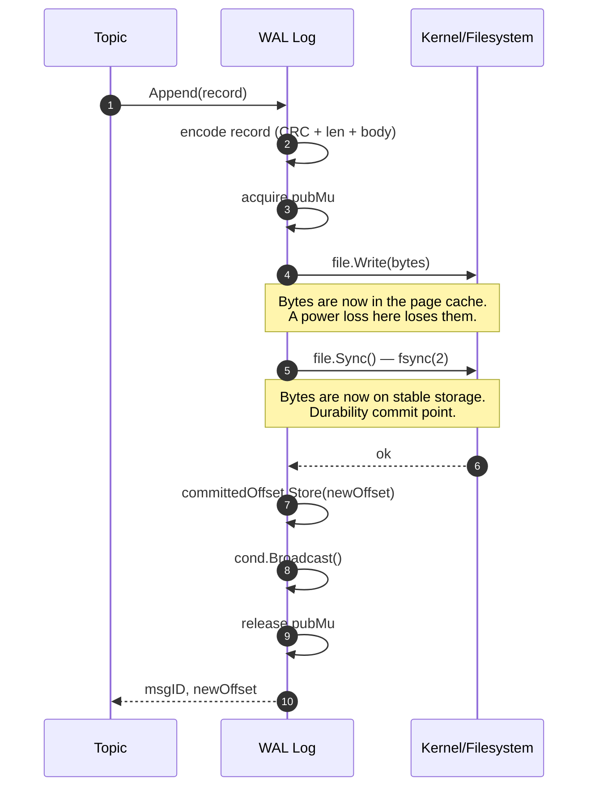
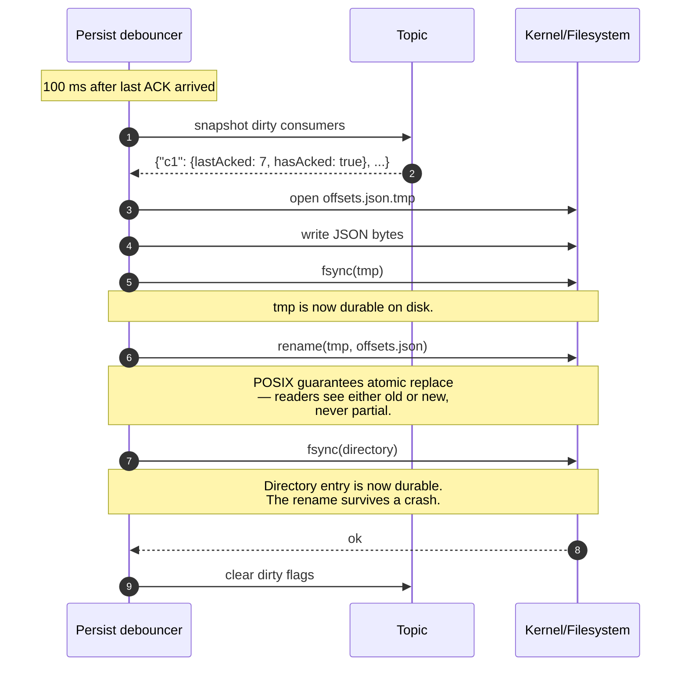
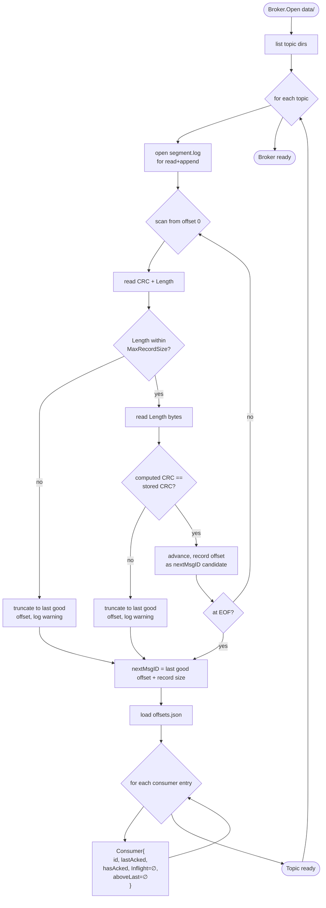
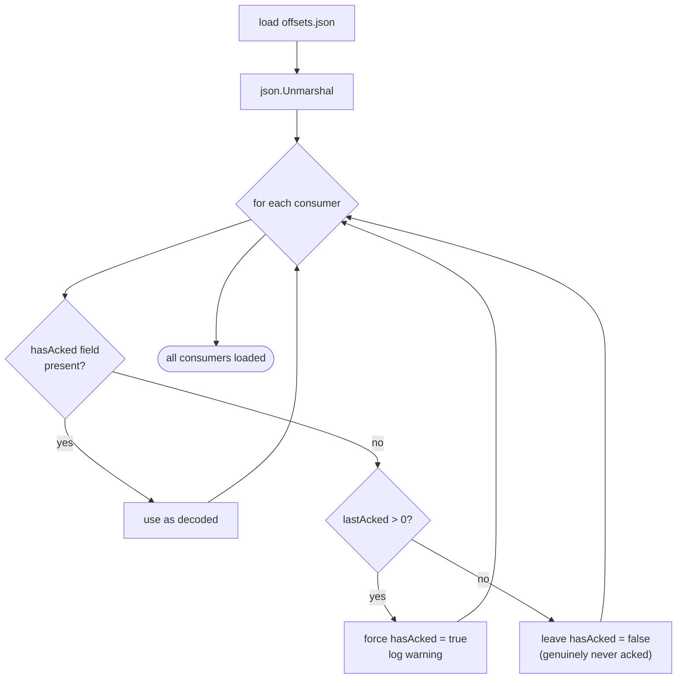
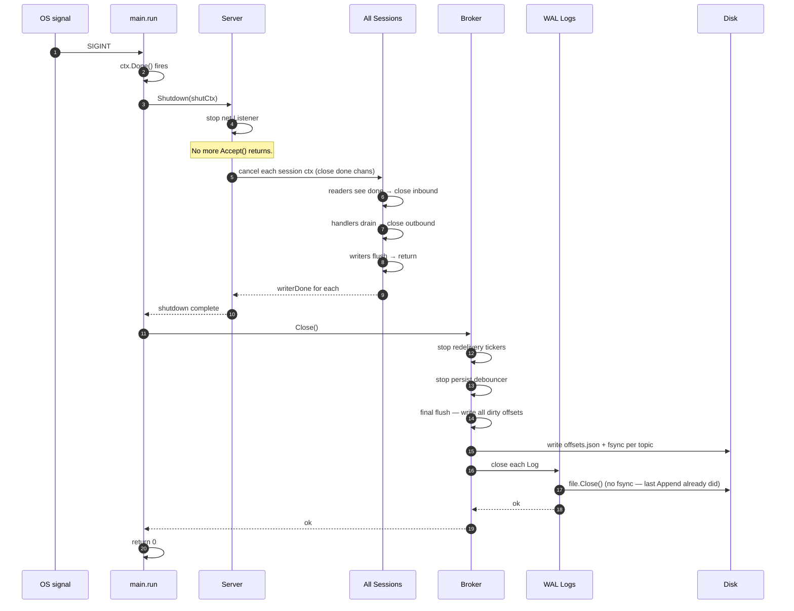

# ToyMQ — Persistence, Recovery & Shutdown

Everything that touches disk. Why fsync, what `offsets.json` looks like,
how recovery handles a torn tail, and what the broker does between
SIGTERM and `exit 0`.

See also: ADRs [`0001`](./adr/0001-framed-record-format.md),
[`0002`](./adr/0002-per-message-fsync.md),
[`0003`](./adr/0003-recovery-by-scan.md),
[`0006`](./adr/0006-debounced-atomic-offsets.md);
[`ARCHITECTURE.md`](./ARCHITECTURE.md) for the WAL byte framing;
[`REDELIVERY.md`](./REDELIVERY.md) for why consumer state matters at
recovery time.

---

## 1. On-disk layout

```
data/
└── topics/
    ├── orders/
    │   ├── segment.log     ← append-only WAL, one record per PUB
    │   └── offsets.json    ← per-consumer state, written by debouncer
    └── events/
        ├── segment.log
        └── offsets.json
```

One directory per topic, two files per topic. No metadata file, no
index, no manifest. The recovery scan walks every segment from offset
zero on Open; ADR 0003 explains why "scan everything on Open" is the
right call for a single-node learning broker.

`segment.log` grows monotonically. There is no compaction in v1 — a
busy topic's WAL grows forever. Adding rolling segments + compaction is
a deliberate stretch goal called out in `.plan/BUILD_GUIDE.md`.

---

## 2. WAL Append — the durability commit point

`Log.Append` is the only function in ToyMQ that calls `fsync`. Every PUB
goes through it. Every OK that the broker emits is, by construction,
preceded by a successful fsync of the corresponding record.



The committed-offset update happens **after** the fsync. Any reader
that sees `committedOffset == X` is guaranteed that bytes through `X`
are on disk. The `sync.Cond.Broadcast` wakes any `runDelivery`
goroutines parked on `Reader.Next` — that's the link between a
publisher's fsync and a subscriber's MSG.

ADR 0002 covers why this is the default rather than batched fsync.
Short version: per-message fsync is the simplest durability story to
reason about, and the cost (~1–2 ms per call on commodity SSD) is
acceptable for the build-it-and-learn target.

---

## 3. `offsets.json` atomic swap

Consumer state — `lastAcked`, `hasAcked`, `aboveLast` — has to survive
a restart. The debouncer collects dirty consumers for up to 100 ms,
then performs a POSIX-atomic file replacement: write a temp file,
fsync it, rename over the old file, fsync the directory. ADR 0006
explains why the debounce is safe.



Three fsyncs per persist: tmp file, directory after rename, and the
broker-shutdown final flush (covered below). The debouncer collapses
bursts — 1000 acks in 100 ms cost the same as 1 ack in 100 ms.

If the broker crashes between an ack arriving in memory and the next
debouncer fire, that ack is lost. The WAL is the source of truth: the
ack's message is still there, still has its WAL offset, and will be
redelivered on resume. The consumer acks again, the system converges.
This is at-least-once preservation despite the eventual-durability of
acks.

---

## 4. Recovery on `Broker.Open`

Boot reads everything from disk. For each topic directory: scan the
WAL to find the last valid record, derive `nextMsgID`, then load
`offsets.json` to restore consumer state.



A torn tail — typically the last partial record from a SIGKILL during
Append — is detected by either a length-out-of-bounds or a CRC
mismatch. Both branches truncate to the last known-good offset; the
broker continues from there. Producers that never received the OK for
the torn message will retry (with the same dedupe key, if they had
one); the WAL ends up consistent.

Note that `Inflight` and `aboveLast` are intentionally empty on
restart. Any messages that were inflight before the crash are now
"pending" again — they sit in the WAL between `lastAcked + 1` and
`nextMsgID`. The next subscribing consumer reads them as a normal
backlog. The visibility-timeout mechanism is a runtime concept; on
restart, every pre-crash inflight becomes a pre-crash pending.

---

## 5. `offsets.json` migration / legacy files

ADR 0011 introduced the `hasAcked` flag as a new field in
`offsets.json`. Pre-fix files don't have it. The JSON decoder defaults
the absent field to `false`, which would make a consumer with
`lastAcked: 7` look like "never acked, start from 0" on resume.



In a learning project with no production deployment the migration cost
is zero — wipe `data/` and start over. The defensive branch is
documented in ADR 0011 as the path forward if that ever changes.

---

## 6. Graceful shutdown sequence

When `toymq` receives SIGINT or SIGTERM, `main.run` notices `ctx.Done`
and walks a deterministic teardown: stop accepting new conns, drain
existing sessions, flush pending offset writes, close WAL files. The
goal is "nothing in flight, nothing un-fsynced" before exit.



The shutdown is bounded by `cfg.ShutdownTimeout` (default 5 s). If
sessions don't drain in time, `srv.Shutdown` returns an error and main
logs it but still proceeds to `broker.Close` — the offsets flush is
non-negotiable. A SIGKILL bypasses this entire path; the chaos suite
verifies that the resulting on-disk state is still recoverable.

---

## 7. What the WAL guarantees, what it doesn't

Things this design **does** guarantee:

- Any MsgID for which the broker emitted `OK` is durable on disk.
- After any unclean exit, recovery rebuilds Topic state up to a
  consistent point. The torn tail, if any, is discarded.
- Once `offsets.json` has been written, the consumer's `lastAcked` is
  durable. Acks in the 100 ms debounce window may be lost — but their
  messages are not, and at-least-once redelivery covers the gap.

Things this design **does not** guarantee:

- Dedupe LRU is in-memory only. Across a restart, the same dedupe key
  produces a new MsgID. ADR 0013 documents the chaos-test consequence.
- No cross-segment, cross-topic, or cross-broker ordering. WAL ordering
  is per-topic only.
- No replication. A disk failure means data loss; this is a single-node
  broker by design.
- No PUB pipelining. Each PUB blocks on its own fsync. Batch-fsync mode
  is on the roadmap but not in v1.
