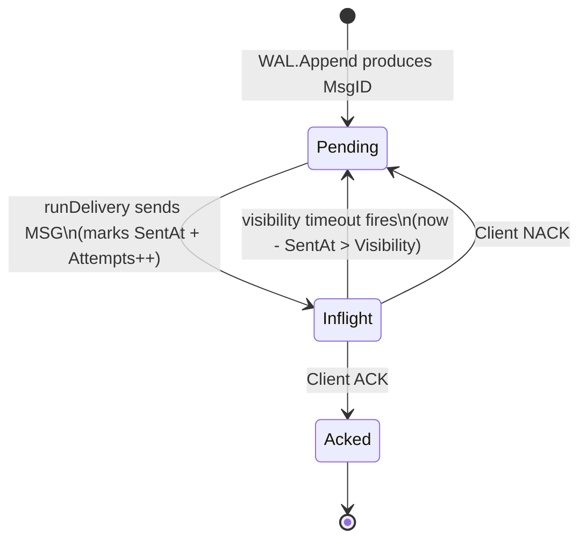
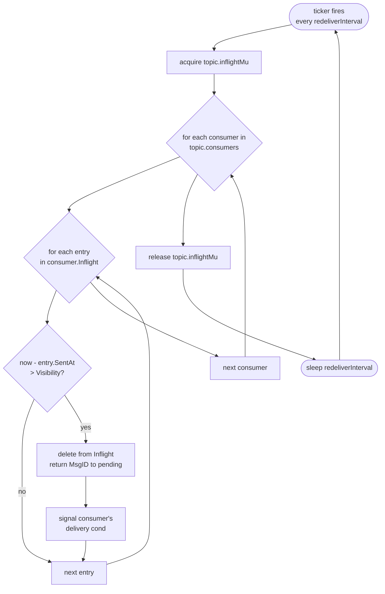
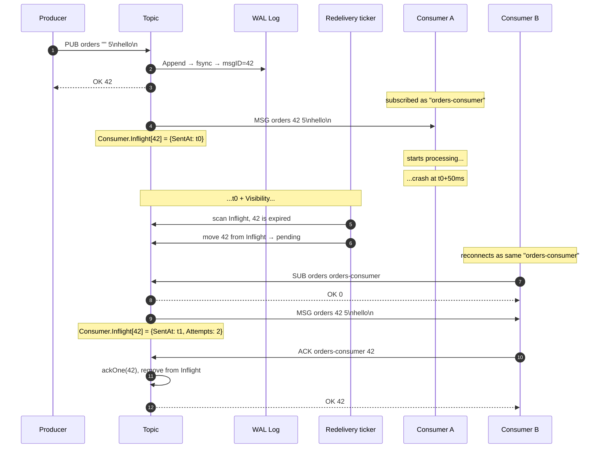
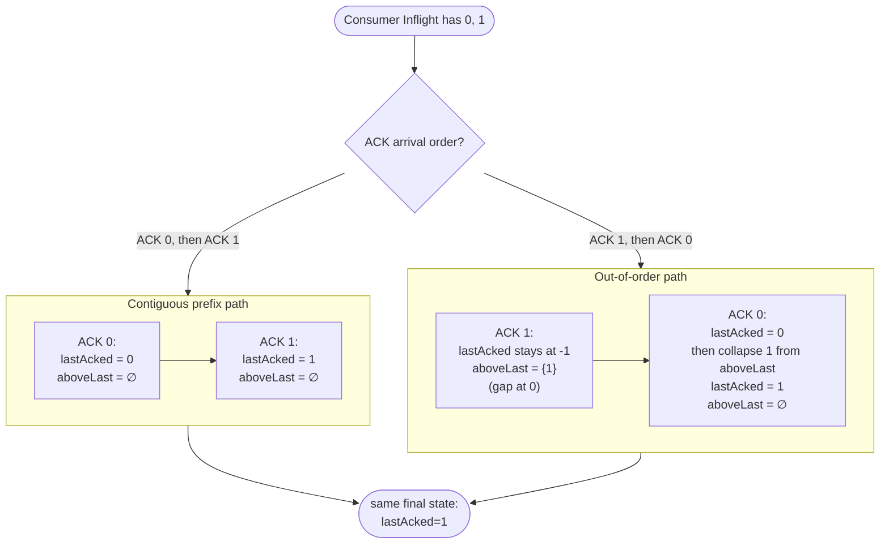

# ToyMQ — Redelivery & At-Least-Once

ToyMQ promises **at-least-once delivery**: every published message will
be delivered to at least one consumer of its topic, and an acknowledged
message will never disappear. The corollary — sometimes a message is
delivered more than once — is the price.

Three mechanisms keep that promise:

1. **Inflight tracking** marks each delivered MSG as held by a consumer.
2. **Visibility timeout** auto-returns held messages that aren't acked
   in time, on the assumption the consumer crashed.
3. **NACK** is the explicit, fast version of the same idea.

This doc covers all three plus the load-bearing `lastAcked` rule that
makes per-consumer offsets honest.

See also: ADRs [`0007`](./adr/0007-visibility-timeout-redelivery.md),
[`0011`](./adr/0011-consumer-state-hasacked.md);
[`FLOWS.md`](./FLOWS.md) for the per-command sequence diagrams;
[`PERSISTENCE.md`](./PERSISTENCE.md) for how this state survives a
restart.

---

## 1. Visibility-timeout state machine

Every message a consumer has been told about lives in one of three
states. NACK and visibility timeout move it the same direction
(`Inflight → Pending`); ACK moves it forward to `Acked`.

A message can bounce between `Pending` and `Inflight` many times before
reaching `Acked` — that's the at-least-once contract. The chaos suite's
no-loss invariant verifies that every acked MsgID reaches at least one
consumer's seen set. Duplicates above one are allowed.

The visibility window defaults to **30 seconds in production**
(`internal/broker/broker.go`, `New`) and **100 ms in tests**
(`internal/broker/broker_test.go`, `NewWithTimings`). The shorter test
value makes redelivery observable on millisecond timescales without
making the broker fragile.

---

## 2. Redelivery ticker — inside the loop

Each Topic has a single redelivery goroutine that wakes on a fixed
interval, scans every consumer's Inflight map, and requeues anything
whose `SentAt` is older than the visibility window. ADR 0007 explains
why a ticker (rather than per-message timers) is the right primitive
here.

Two knobs control this loop:

- **`Visibility`** — how long to wait before assuming a consumer is
  dead. Default 30 s.
- **`redeliverInterval`** — how often to check. Default 1 s in
  production, 20 ms in tests. The ticker fires this often regardless of
  whether anything has expired.

The lock is held only for the duration of the scan, which is
proportional to total inflight count. For small loads this is
microseconds; if it ever became a bottleneck, the natural fix is a
priority queue keyed by `SentAt + Visibility`.

---

## 3. End-to-end redelivery story

The clearest way to internalize at-least-once: walk a single message
all the way from publish through a crash and a successful retry.

Three things to notice. First, the WAL is untouched throughout — msg
42's bytes live in the segment file and are read twice. Second,
`Attempts` is the only consumer-side signal that a redelivery happened;
clients that care can inspect it (the wire protocol doesn't currently
surface it, but the broker tracks it). Third, the producer never learns
that anything went wrong; from its perspective there was a single
`OK 42`.

---

## 4. Gap-aware `lastAcked`

The trickiest piece of consumer state. ADR 0011 introduced the
`hasAcked` flag to disambiguate "never acked" from "acked msg 0." Just
as important is what happens when acks arrive **out of order**, which
is allowed by the protocol but can leave gaps in the acked-ID sequence.

Both paths converge on the same final state, but the intermediate state
matters. During Path2's first step:

- The consumer disconnects at this point.
- The redelivery ticker fires and returns msg 0 to pending (it's still
  in Inflight, never acked).
- A new consumer with the same ID resumes. `runDelivery` starts at
  `lastAcked + 1 = 0` because `lastAcked` is still at the initial
  sentinel.
- The new consumer is correctly handed msg 0 again.

Without the `aboveLast` set, the broker would lose msg 1's ack. With
it, every ack is remembered until it can be safely retired by the
contiguous-prefix collapse. This is what makes the at-least-once
contract robust even when consumers ack out of order.

The `toymqctl ack <high-id>` subcommand relies on exactly this property:
acking a high id while earlier ids stay un-acked is **allowed** but does
not advance `lastAcked` past the gap. The CLI's `-h` warning calls this
out so users aren't surprised by replays.
